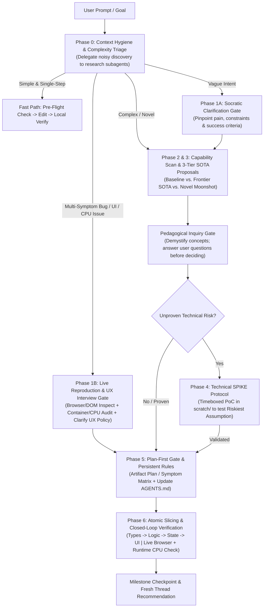

# Frontier Architect Workflow Diagram

```mermaid
flowchart TD
    Start["User Prompt / Goal"] --> Hygiene["Phase 0: Context Hygiene & Complexity Triage\n(Delegate noisy discovery to research subagents)"]
    
    Hygiene -->|Simple & Single-Step| FastSlice["Fast Path: Pre-Flight Check -> Edit -> Local Verify"]
    Hygiene -->|Multi-Symptom Bug / UI / CPU Issue| DiagGate["Phase 1B: Live Reproduction & UX Interview Gate\n(Browser/DOM Inspect + Container/CPU Audit + Clarify UX Policy)"]
    Hygiene -->|Vague Intent| Clarify["Phase 1A: Socratic Clarification Gate\n(Pinpoint pain, constraints & success criteria)"]
    Hygiene -->|Complex / Novel| Elevate["Phase 2 & 3: Capability Scan & 3-Tier SOTA Proposals\n(Baseline vs. Frontier SOTA vs. Novel Moonshot)"]
    
    Clarify --> Elevate
    DiagGate --> PlanGate
    
    Elevate --> Dialogue["Pedagogical Inquiry Gate\n(Demystify concepts; answer user questions before deciding)"]
    Dialogue --> RiskCheck{"Unproven Technical Risk?"}
    
    RiskCheck -->|Yes| Spike["Phase 4: Technical SPIKE Protocol\n(Timeboxed PoC in scratch/ to test Riskiest Assumption)"]
    RiskCheck -->|No / Proven| PlanGate["Phase 5: Plan-First Gate & Persistent Rules\n(Artifact Plan / Symptom Matrix + Update AGENTS.md)"]
    Spike -->|Validated| PlanGate
    
    PlanGate --> Loop["Phase 6: Atomic Slicing & Closed-Loop Verification\n(Types -> Logic -> State -> UI | Live Browser + Runtime CPU Check)"]
    Loop --> Handoff["Milestone Checkpoint & Fresh Thread Recommendation"]
```
